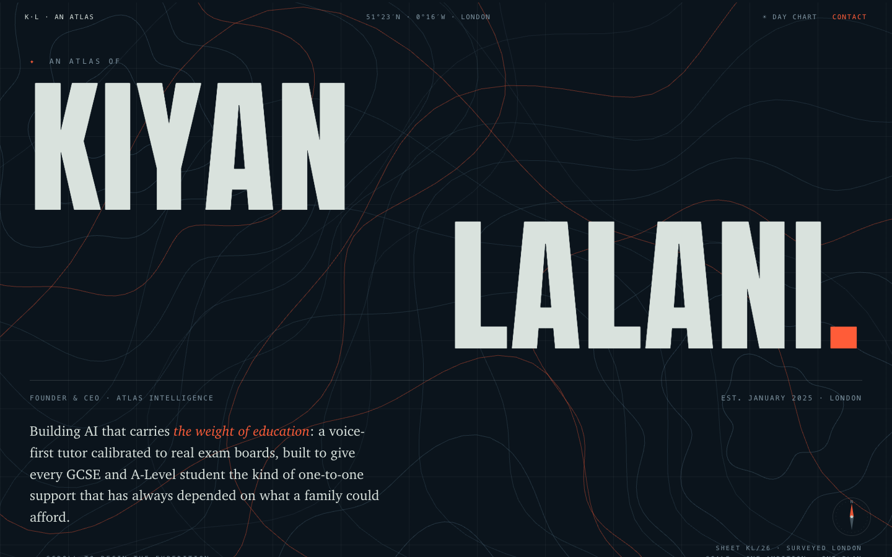
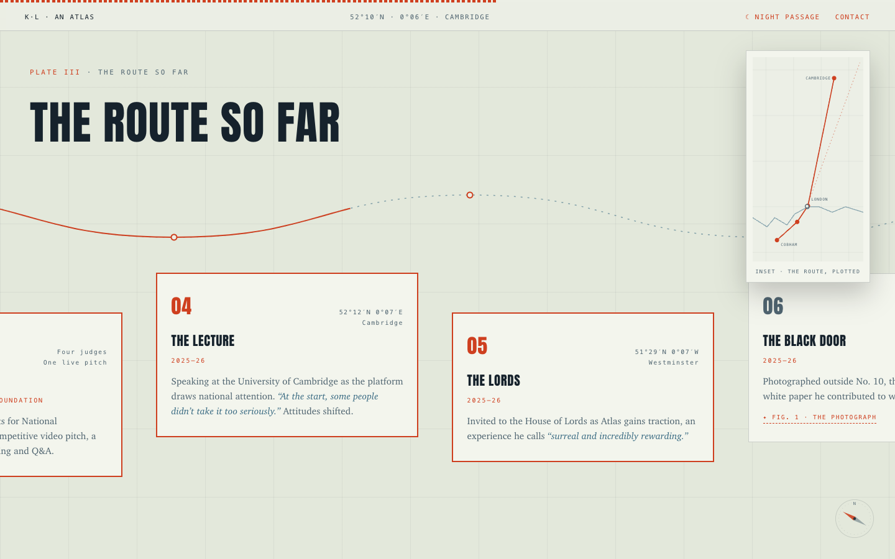

# An Atlas of Kiyan Lalani

Personal site for Kiyan Lalani, founder & CEO of Atlas Intelligence.
Live at **[kiyanl.co.uk](https://kiyanl.co.uk)**.



## The idea

Atlas carries two meanings: the titan holding up the weight (the company is named for carrying "the weight of education") and a book of map plates. The site is built as the latter. Sections are plates, waypoints carry real coordinates, and scrolling is the expedition.



## Details

- A single static `index.html`. No framework, no build step, no dependencies. The display face (Anton) is embedded as a data URI; body text is system Charter/Georgia; coordinates are set in the system mono.
- Two themes, day chart and night passage: follows the system by default with a manual toggle, both driven by one set of CSS custom properties.
- Scroll work: a contour-line canvas hero, letter-stagger title, velocity-skewed marquee, a sticky horizontal route with an inking SVG path, a real-geography inset map (equirectangular projection, drawn in JS), coordinates that drift through the header as you travel the page, a split-flap milestone board, and IntersectionObserver reveals. `prefers-reduced-motion` gets a calm static layout.
- Extras: a custom 404, a print stylesheet, JSON-LD person schema, an OG share card, a one-page PDF CV at `/cv`, and an easter egg (type `atlas`).

## Development

```sh
python3 -m http.server 4173
```

Then open http://localhost:4173. Deployed on Vercel; pushes to `main` go live automatically.

## License

Code is MIT. The text, photographs and personal content are not licensed for reuse.
